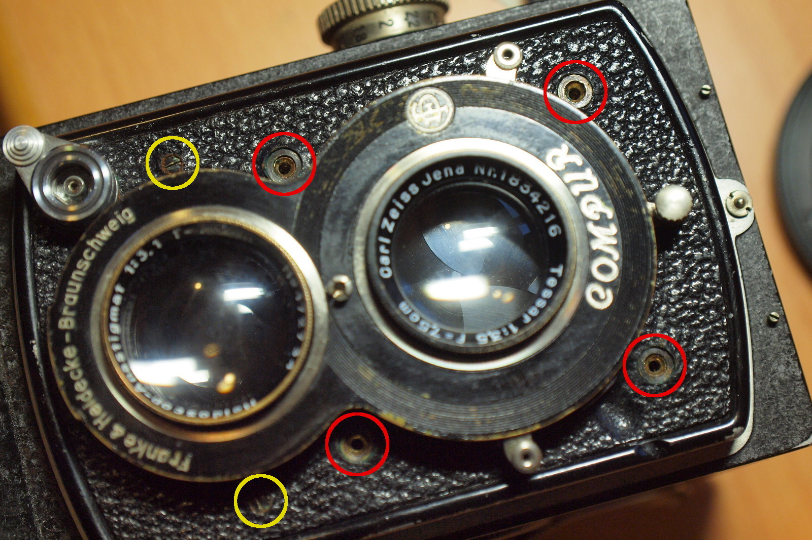
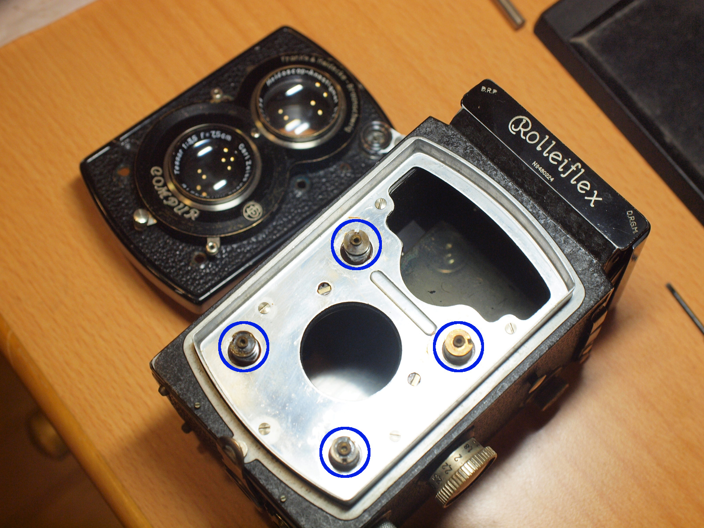
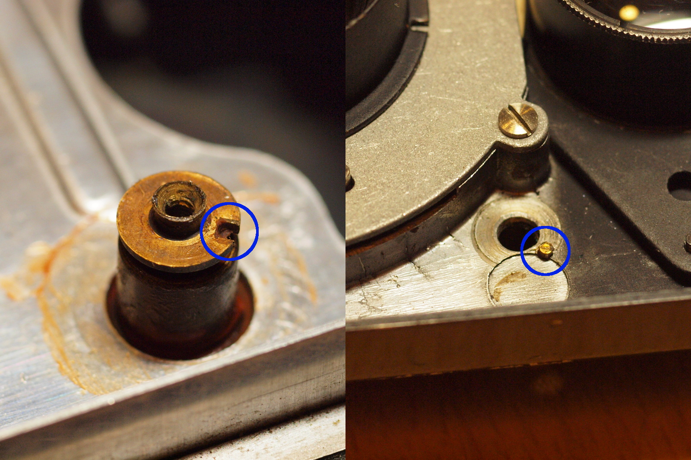
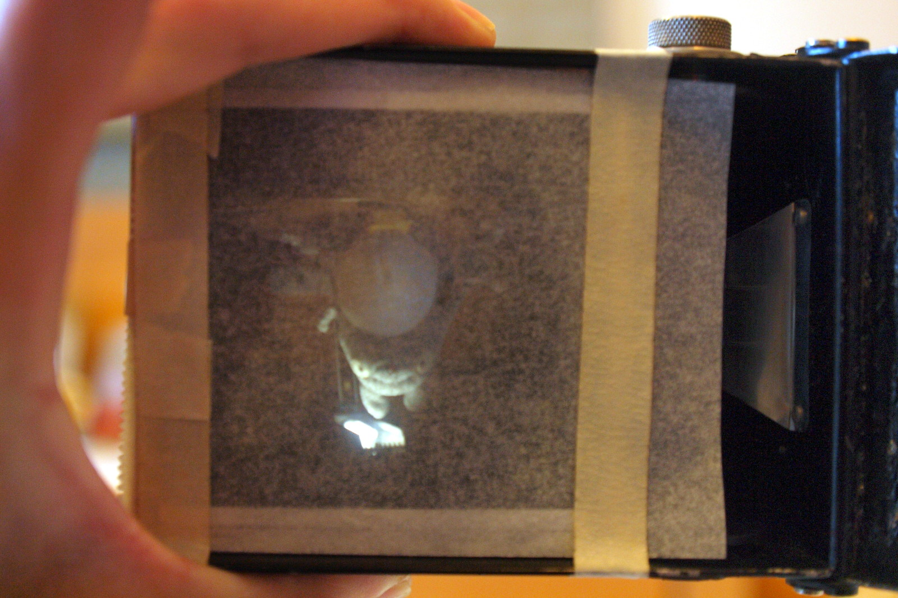
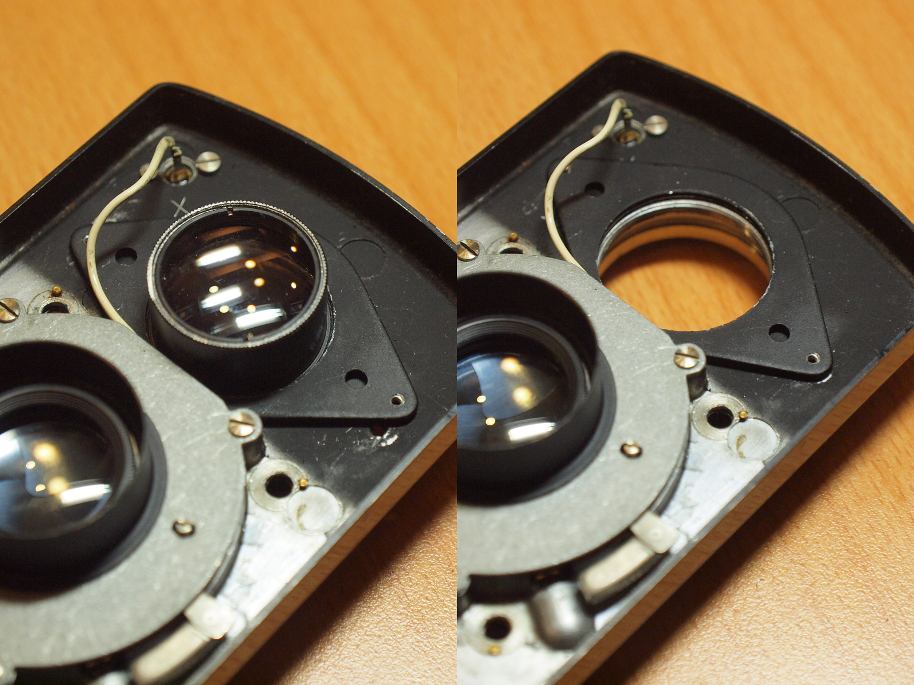

# 拆裝前面板
要拆前面板還算蠻容易的，比較需要注意的是拆下來之後最好不要動到對焦螺絲，不然可能會有額外的調整工作要做。

### 工具與材料
* 一字起子 

### 拆卸前面板
建議先將對焦旋鈕轉到無限遠的位置，再來只要把前面板上的四顆大螺絲卸下來，就可以輕易的把它拆掉，圖中黃色圓框中的螺絲是固定取景鏡頭用的：

拆下前面板後，這裡黃銅色的部份就是對焦螺絲了，如果覺得對焦不順可以對這些螺絲加點潤滑油。另外因為只要輕輕碰到它就會轉，所以請留意，轉一點點還好，轉超過一圈就有可能要整個調整：

### 安裝注意事項
在前面板的螺絲孔上可以看到有個小凸點，這是要跟機身上的對焦螺絲上的缺口咬合的位置：

將前面板裝上去之後先不要急著把螺絲鎖回去，先稍微轉動對焦旋鈕，然後透過螺絲孔觀察對焦螺絲是否有跟著旋轉，在正常狀況下對焦螺絲上的凹槽應該是要跟前面板上的凸點接合在一起，所以應該是不會旋轉的，如果有看到旋轉的狀況那表示角度可能跑掉了，調整一下再重新安裝一次吧。

這裡可以有個說明如何檢查對焦螺絲角度是否正確的影片：[https://www.youtube.com/watch?v=mgkWgJbTUgg](https://www.youtube.com/watch?v=mgkWgJbTUgg)

### 對焦調整
如果不幸動到了對焦螺絲，而又沒辦法讓他恢復到最一開始的狀況，那就得來調整對焦距離啦。這工作蠻麻煩的，最糟的情況就是除了要調整對焦螺絲之外，還得調整取景鏡頭。

首先將對焦旋鈕轉到無限遠的記號上，然後把描圖紙或磨砂玻璃貼在底片的位置：

然後重複進行：調整對焦螺絲->組合前面板->對無限遠的目標物（明亮的月亮，遠方的景物等等）對焦，當遠方的景物清晰可見時就完成了，如果還嫌不夠也可以對旋鈕上的其他距離如2m, 1.8m等距離做進一步的驗證與調整，只要記住無限遠必須合焦這點就可以了。

### 拆卸取景鏡頭
如果萬一在調整好對焦螺絲後，發現從底片室對一目標物正確對焦，但從取景器裡看進去卻沒有合焦，那麼這時候就需要來調整取景鏡頭了。取景鏡頭的固定方式是將鏡頭同時旋入前面板以及一塊固定板，再透過兩支螺絲將固定板鎖在前面板上，所以首先要做的就是拆掉那兩支螺絲（請參閱「拆卸前面板」章節中照片裡的黃圈就是了），接著轉鬆那片固定板之後就可以將鏡頭轉下來了，不過如果只是要微調的話不建議把它整個拆下來：

調整的方式是先讓拍攝鏡頭對一目標物合焦後，重複進行：轉鬆一點固定片->轉動一點取景鏡頭->從取景器檢查是否有合焦。最後調整完把螺絲鎖回去就大功告成了。