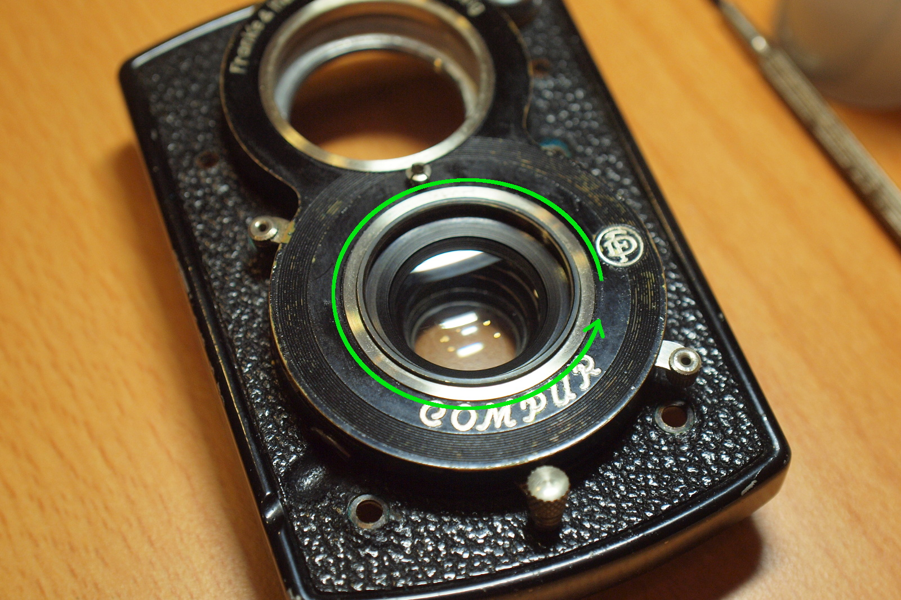
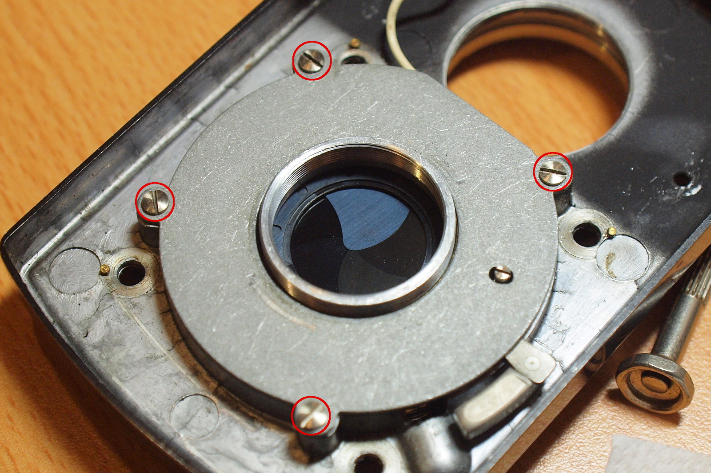
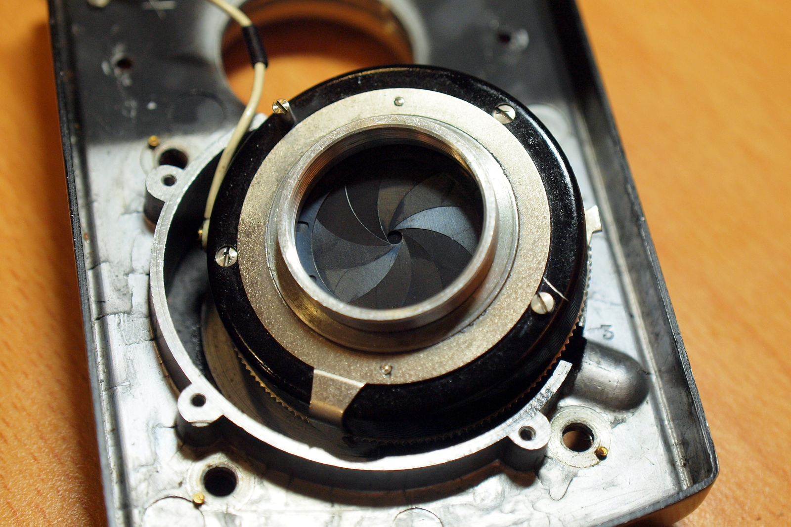
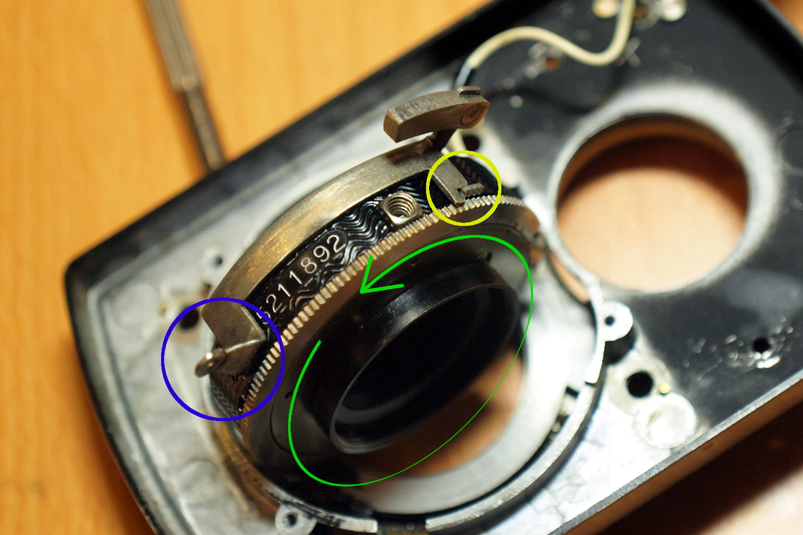

# Taking Lens Cleanup
There were some fungus on the Carl Zeiss Tessar lens of this camera. Unfortunately it was the rear lens that got affected, so we will need to [remove the front plate](front_plate.md).

### Lens Design
The Carl Zeiss Tessar has a 3-groups-4-elements design: four lenses in three parts. The Compur is located between the second and the third group.

(Source: [Wikipedia - History of photographic lens design](https://en.wikipedia.org/wiki/History_of_photographic_lens_design))

### Tools and Materials

* Lens paper, diluted alcohol
* Flat-blade screwdriver
* Rubber mat
* Spanner wrench (or a metal ruler will do, but not recommended)

You don't need any tools here if you only need to remove the front lens.

### Front Lens Removal
This is the easiest part, just turn the lens with your hands in counter-clockwise direction to remove it. If it's too tight, try to use the rubber mat to increase the friction:

### Rear Lens Removal
After the [front plate was removed](front_plate.md), the first thing in sight is the light shade on the rear lens, remove it by turning it in counter-clockwise direction (or use the spanner wrench):

The rear lens can be removed now, turn it in counter-clockwise direction:

Fungus on the read lens, you can see they grow on the edge:

The fungus trace still can be seen if you breath on the glass:

Now all the lenses are available for cleaning. For the middle lens which is still attached to the front plate, use T shutter to open the blades and you will be able to clean both sides.

To remove the middle lens, unscrew it from the front plate in counter-clockwise direction. As shown in the picture below, this might be a difficult task as it's just slightly extended from the front plate. (Rubber mat might be useful here) Anothor approach is to remove the Compur component, and unsecrew the lens from it.

若想將光圈快門組件卸下來，首先要把快門撥桿上的撥鈕拆下來，用一字起子抵住螺帽缺口，然後往逆時針方向扭動撥鈕即可：

再來是移除擋板的四顆螺絲：

拿掉固定板之後，會看到一片快門控制連桿，照片中這個被拆下來的金屬環是安裝在它與光圈快門組件之間當作軸襯用的：

先拿掉那個金屬環，讓快門控制連桿有空間可以活動，接著從靠近取景鏡頭那一側把它抬起來，然後再從前面板抽出來。搞定之後就可以把整個光圈快門組件拿起來：

從這就可以很輕鬆的把中鏡組給轉下來了，下面這張照片裡的快門連桿片是裝回去的狀態，藍框裡的東西就是會伸到前面板外的快門撥桿，而黃框就是這個連桿與光圈快門組件連動的地方，在推動快門撥桿的同時也會推動組件上的這個小金屬片來完成快門的上弦，而裡面那個像是螺絲孔的地方就是接快門線的地方啦：

拆下來的東西（注意快門連桿不在裡面）：

清理前後的比較，有些灰塵，不過已經好不少了：

### Note for Assembly
將光圈快門組件裝回去的時候要注意光圈與快門撥桿要準確的與前面板撥桿的溝槽接合：

同樣的，快門撥桿也是一樣：
