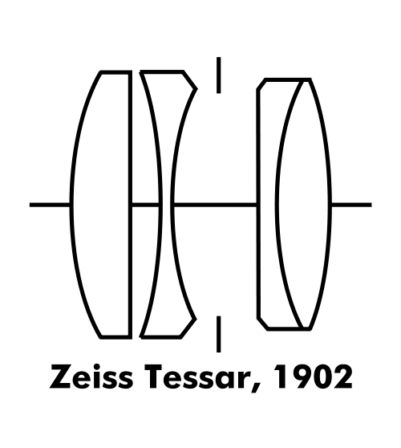
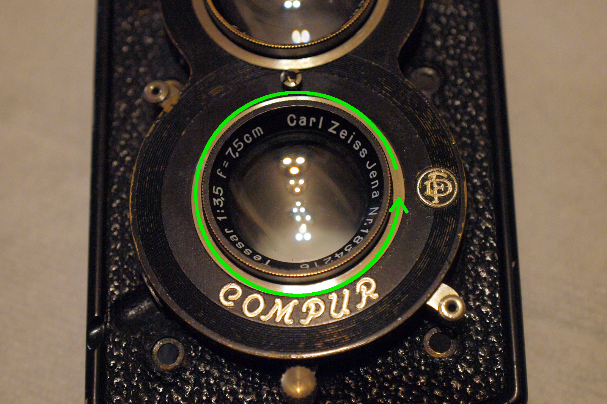
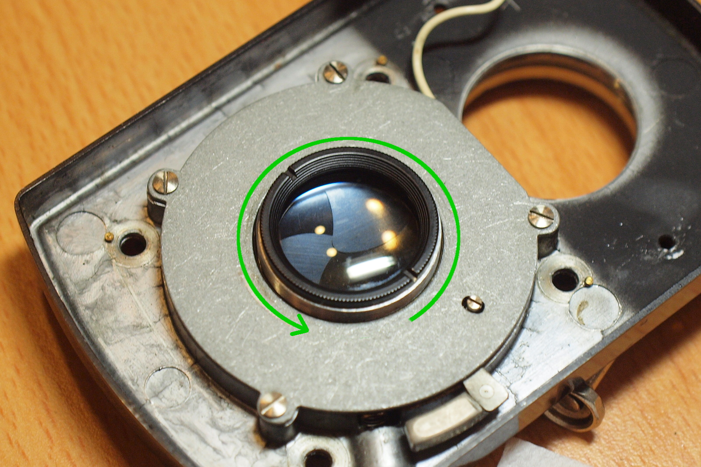
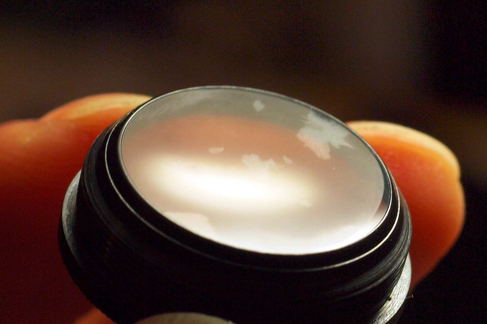

# Taking Lens Cleanup
There were some fungus on the Carl Zeiss Tessar lens of this camera. Unfortunately it was the rear lens that got affected, so we will need to [remove the front plate](front_plate.md).

### Lens Design
The Carl Zeiss Tessar has a 3-groups-4-elements design: four lenses in three parts. The Compur is located between the second and the third group.

(Source: [Wikipedia - History of photographic lens design](https://en.wikipedia.org/wiki/History_of_photographic_lens_design))

### Tools and Materials

* Lens paper, diluted alcohol
* Flat-blade screwdriver
* Rubber mat
* Spanner wrench (or a metal ruler will do, but not recommended)

You don't need any tools here if you only need to remove the front lens.

### Front Lens Removal
This is the easiest part, just turn the lens with your hands in counter-clockwise direction to remove it. If it's too tight, try to use the rubber mat to increase the friction:

### Rear Lens Removal
After the [front plate was removed](front_plate.md), the first thing in sight is the light shade on the rear lens, remove it by turning it in counter-clockwise direction (or use the spanner wrench):

The rear lens can be removed now, turn it in counter-clockwise direction:

Fungus on the read lens, you can see they grow on the edge:

The fungus trace still can be seen if you breath on the glass:

Now all the lenses are available for cleaning. For the middle lens which is still attached to the front plate, use T shutter to open the blades and you will be able to clean both sides.

### Middle Lens Removal
To remove the middle lens, unscrew it from the front plate in counter-clockwise direction. As shown in the picture below, this could be a difficult task as the lens is just slightly extended out from the front plate (rubber mat might be useful here). Another approach is to [remove the Compur component](disassemble_compur.md), and unscrew the lens from it.

With Compur removed (note that the shutter coupler is not in this picture):

Before and after comparison, there are still some dusts inside, but it's much better now:

