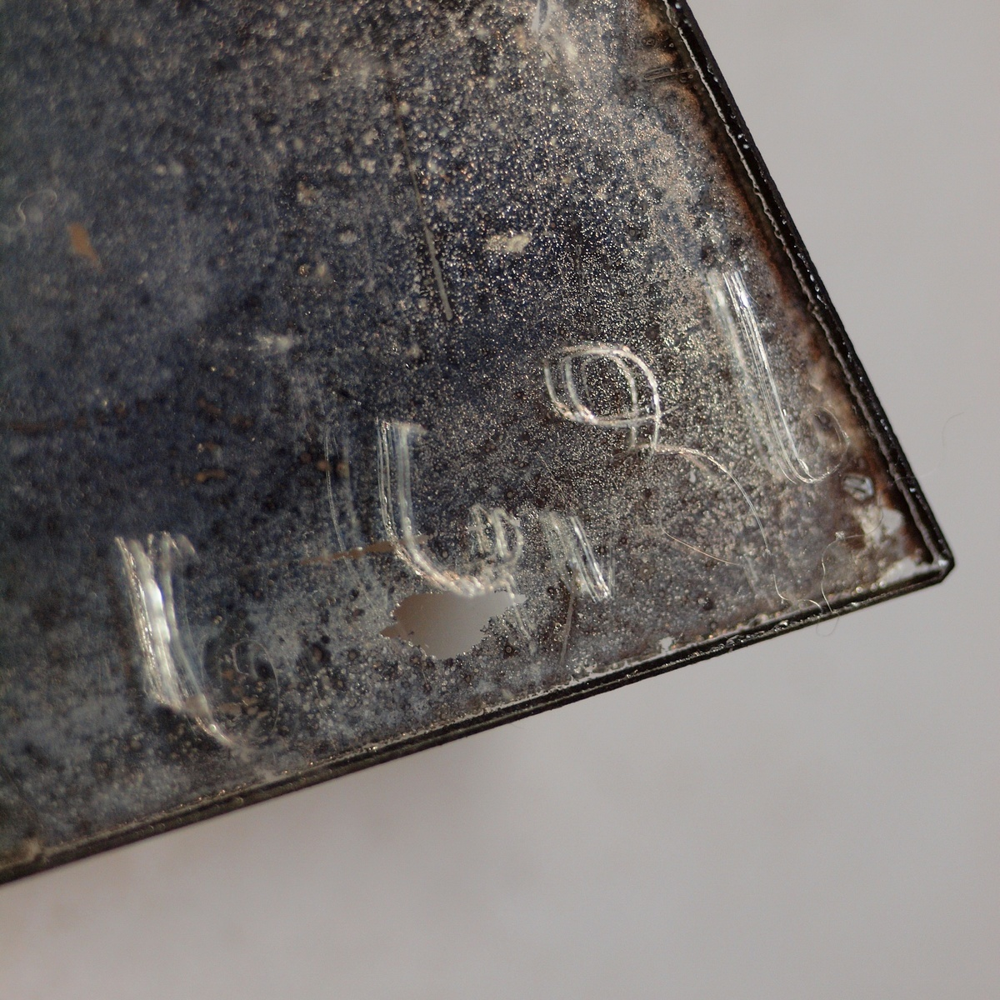
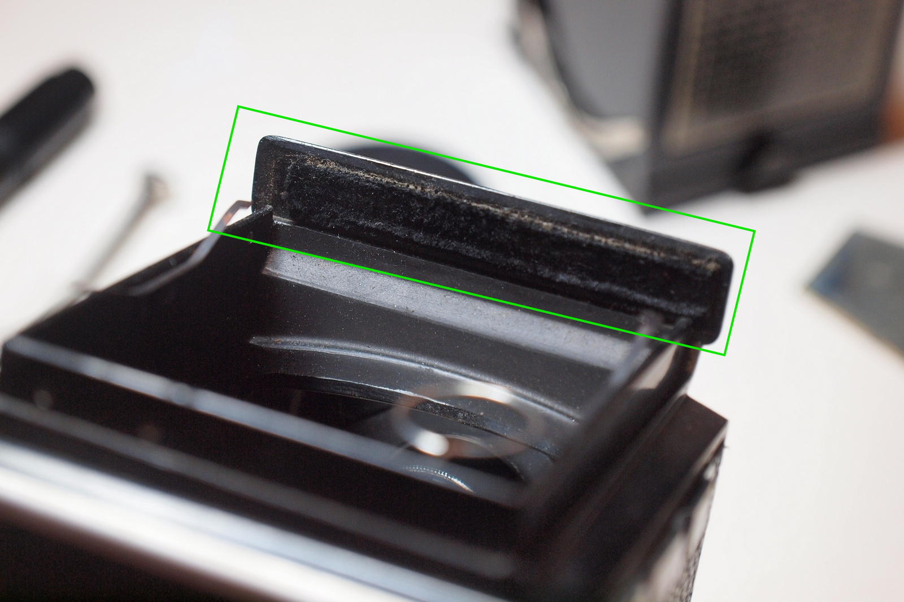

# Mirror Replacement
As time goes by, the mirror in this camera has heavily degraded. Notably dims the light to the focus screen and affecting the focus process. It looks like it's just need to be cleaned, but when you gently wipe the mirror, the coating will came off right away. Replace it is the only solution.

### Tools and Materials
* Flat-blade screwdriver
* New mirror
* Calipers (to check the thickness of the old / new mirror)
* Level (to calibrate the level in the camera) a calibrated tripod will make this easier

### Steps
1. Remove the flat-blade screws on the both side of the viewfinder to remove it:

2. With viewfinder removed, the focus screen is now in sight. Which is supported by springs on both sides. The springs will pop the focus screen out after removing the viewfinder. The screen can be removed now:

Note: The focus screen is super easy to get scratched, please handle with care. When installing the focus screen, make sure you have it aligned with the edge of the camera body. It should be pushed down into the body when the viewfinder installed on top of it.

3. Remove the level, and those screws for the frame:

4. Remove the retainer and two screws for the mirror to remove it:

Side-by-side comparison, you can see how bad it is:

You can find the date of manufacture in the corner on the back of the mirror, if it's an original one (a little bit hard to read):

Looks like it's made in 1936 , which means it's 80 years old now!

5. Note that as this mirror is a front surface mirror (FSM). When you are installing the mirror, the coating side should face upward, otherwise you will see ghost images. Also, do not forget to calibrate the level and adjust or replace the light seal between the body and the viewfinder:

Before and after replacing the mirror:

### Mirror Specification
The following dimensions are from the Internet, I made my mirror order with this specification too. (With 1.2mm thickness):
* Thickness: 1.6mm
* Height: 54.5mm
* Short edge: 27.5mm
* Long edge: 47.5mm

These are the dimensions from the old mirror, measured with my caliper. The result is almost identical, except the difference in the thickness. Which can be compensated by sticking some plastic cards on the back of the mirror.
* Thickness: 1.85mm
* Height: 53.7mm
* Short edge: 27.55mm
* Long edge: 47.4mm

From the pictures above, the tolerance for the short and long edges are much higher, if it can be put into the groove, it should be fine. Same as the height, as long as it's not exceeding the retainer too much.
The most import figure is the thickness of the mirror. Since the distance from the lens to the film remain constant, the change in mirror thickness will cause focus shift. This is the reason why having a caliper at hand will be better for this task.

### Appendix - Mirror Specification for other cameras
I got this table from the mighty Internet, probably an ebay product page but sadly I can't recall. And I don't have all these machines at hand so it's just a FYI. If you happen to know the mirror spec of your camera please let me know. I will add it here.

| Model                                          | Thickness | Long Side | Short Side |  Height  |
|------------------------------------------------|-----------|-----------|------------|----------|
| Rolleiflex K1                                  |  0.98 mm  |  49.25 mm |  25.25 mm  | 54.25 mm |
| Rolleiflex Standard K2 620 (Tessar 75/4.5)     |  1.60 mm  |  47.50 mm |  27.50 mm  | 54.00 mm |
| Rolleiflex Standard K2 621 (Tessar 75/3.8)     |  1.00 mm  |  47.00 mm |  27.50 mm  | 54.50 mm |
| Rolleiflex Standard K2 622 (Tessar 75/3.5)     |  1.60 mm  |  47.50 mm |  27.50 mm  | 54.00 mm |
| Rolleiflex Standard k4 640                     |  1.25 mm  |  50.50 mm |  31.50 mm  | 63.50 mm |
| Rolleiflex 3.5E,F; 2.8F (for eye level finder) |  1.25 mm  |  39.00 mm |  27.00 mm  | 30.00 mm |
| Rolleiflex 2.8F and 3.5E, F                    |  1.60 mm  |  51.00 mm |  32.00 mm  | 63.00 mm |
| Rolleiflex 2.8F                                |           |  50.00 mm |  31.00 mm  | 65.00 mm |
| Rolleiflex 3.5E2,E3,F; 2.8E,E3,F               |  1.50 mm  |  51.00 mm |  32.00 mm  | 64.50 mm |
| Rolleiflex Baby 4x4 (pre-war)                  |  1.10 mm  |  33.50 mm |  24.50 mm  | 44.00 mm |
| Rolleiflex Baby 4x4 (post-war)                 |  1.60 mm  |  39.00 mm |  23.00 mm  | 47.00 mm |
| Rolleicord I, IIb, Vb                          |  1.60 mm  |  51.00 mm |  27.50 mm  | 60.00 mm |
| Rolleicord II, IIa, III                        |  1.25 mm  |  51.00 mm |  28.00 mm  | 60.00 mm |
| Rolleicord Ia                                  |  1.00 mm  |  51.00 mm |  27.00 mm  | 60.00 mm |
| Ikoflex I (850/16), (852/16) II/III            |  1.25 mm  |  49.50 mm |  32.50 mm  | 67.00 mm |
| Rolleiflex 2.8 and 3.5 Model F                 |  1.60 mm  |  51.00 mm |  32.00 mm  | 63.00 mm |
| Rolleiflex Automat 3.5                         |  1.25 mm  |  50.00 mm |  31.00 mm  | 63.00 mm |
| Mamiya c3 & c220f                              |  1.25 mm  |  56.00 mm |  44.00 mm  | 67.00 mm (corner needs to be chamfered 1mm) |
| Mamiya RZ67 Pro II                             |  1.00 mm  |  70mm x 60mm and the 4 corners are chamfered 1mm |
| Yashica MAT or 124G                            |  1.60 mm  |  50.00 mm |  30.00 mm  | 57.00 mm |
| Voigtlander Brilliant S Focusing Bakelite      |  0.98 mm  |  46.00 mm |  30.00 mm  | 57.00 mm |
| Voigtlander Brilliant V6 Bakelite              |  1.10 mm  |  43.75 mm |  30.00 mm  | 48.00 mm |
| Minolta Autocord                               |  1.25 mm  |  50.00 mm |  28.00 mm  | 60.00 mm |

