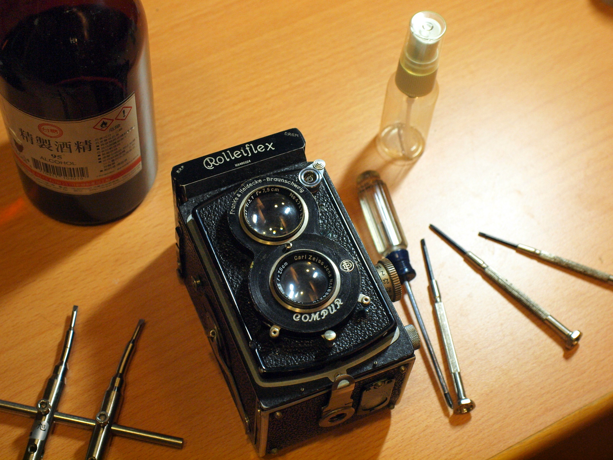

# Rolleiflex 622 K2 維修日誌

這份文件紀錄了當初維修這台相機的步驟，由於維修作業不是一次完成，所以可能會看到照片不大連貫的現象，敬請見諒。
本文以 [Gitbook](https://cypresslin.gitbooks.io/rolleiflex-622-repair/content/) 平台發布，您可以到 [GitHub](https://github.com/Cypresslin/book-repair-rolleiflex622) 找到原始文件，歡迎提供錯字校正與翻譯，同時也可以到 [flickr 相簿](https://www.flickr.com/photos/57342563@N00/albums/72157672119064724)中查看照片。

**請注意這裡提供的所有資訊僅供參考，不提供任何擔保，請自行負擔所有可能的風險**

另外這裡也有關於如何[上片](https://youtu.be/vM9XcC0Qwdc) / [退片](https://youtu.be/Zn-e0FLdRuc)的說明影片可供參考。

在此特別感謝相機主人 ePierre 願意讓我動手修這台他老爸留給他的 80 歲老相機，並借我拍了好幾捲！

2016 Oct. PHLin

#大綱
本文件分為四個章節，分別是：
* [拍攝鏡組清理](lens_cleaning.md)
* [更換反光鏡](mirror_replacement.md)
* [拆裝前面板](front_plate.md)
* [拆卸光圈快門組件](disassemble_compur.md)

#授權
**Rolleiflex 622 K2 維修日誌** 係採用創用 CC 姓名標示-非商業性-相同方式分享 4.0 國際 授權條款授權，您可以自[此網址](http://creativecommons.org/licenses/by-nc-sa/4.0/)取得授權條款全文。

