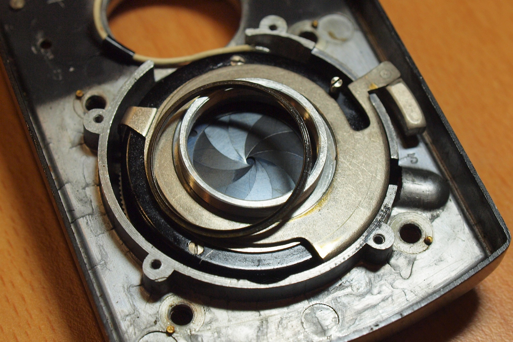
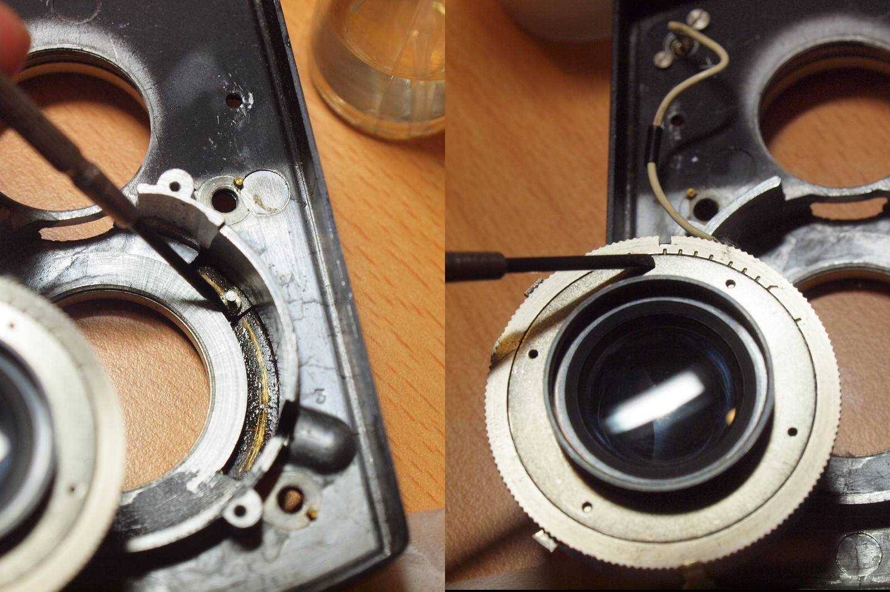

# 拆卸光圈快門組件
這台相機的低速快門運作不大順暢，明顯的比標示的速度還要慢很多，不過很幸運的只需要上點油就解決了。

### 工具與材料
* 一字起子
* 潤滑油

### 施工步驟
在[拆掉前面板](./front_plate.md)以及[後鏡組](./lens_cleaning.md)之後，就可以把光圈快門組件卸下來。首先要把快門撥桿上的撥鈕拆下來，用一字起子抵住螺帽缺口，然後往逆時針方向扭動撥鈕即可：

再來是移除擋板的四顆螺絲：

拿掉固定板之後，會看到一片快門控制連桿，照片中這個被拆下來的金屬環是安裝在它與光圈快門組件之間當作軸襯用的：

先拿掉那個金屬環，讓快門控制連桿有空間可以活動，接著從靠近取景鏡頭那一側把它抬起來，然後再從前面板抽出來。搞定之後就可以把整個光圈快門組件拿起來：

若先前沒辦法成功的把中鏡組給轉下來，這時就可以很輕鬆的把它給拆下來了，下面這張照片裡的快門連桿片是裝回去的狀態，藍框裡的東西就是會伸到前面板外的快門撥桿，而黃框就是這個連桿與光圈快門組件連動的地方，在推動快門撥桿的同時也會推動組件上的這個小金屬片來完成快門的上弦，而裡面那個像是螺絲孔的地方就是接快門線的地方啦：

只要拆掉這幾三個螺絲就可以把光圈與快門組件拆開：

拆開之後的光圈組件：

拆開之後的快門組件：

注意這裡綠圈裡的彈簧，在裝回去的時候記得要先把它往內壓進去。另外這五片快門葉片是會掉下來的，任何彎折都可能會造成動作異常、漏光等狀況，請小心。

對這些齒輪上一點油，快門運作就順多了：

這是快門組件的另一面：

不同的刻度代表著不同的快門速度，內圈的小圓點則是表示當前所選擇的設定，這台相機的快門最快有到1/500秒（不在畫面中）

### 組裝注意事項
將光圈快門組件裝回去的時候要注意光圈與快門撥桿要準確的與前面板撥桿的溝槽接合：

同樣的，快門撥桿也是一樣：
