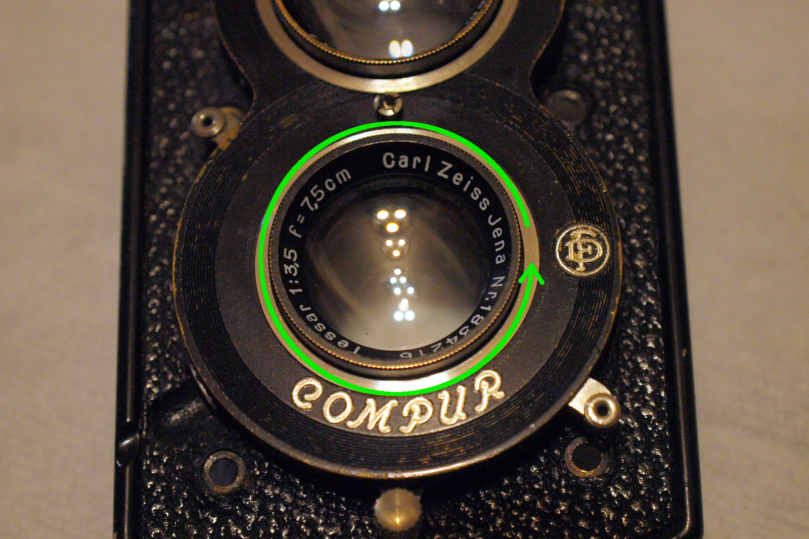
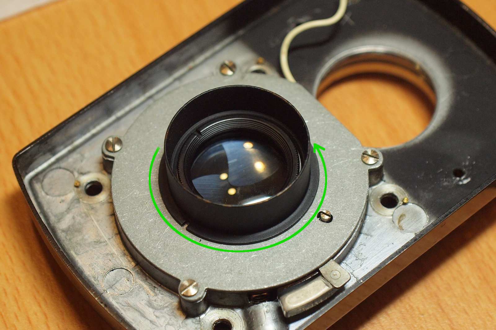
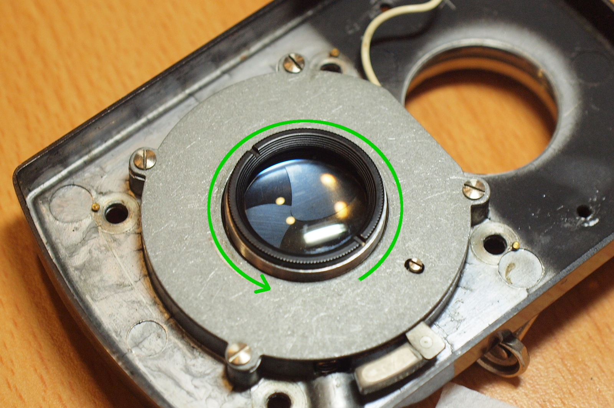
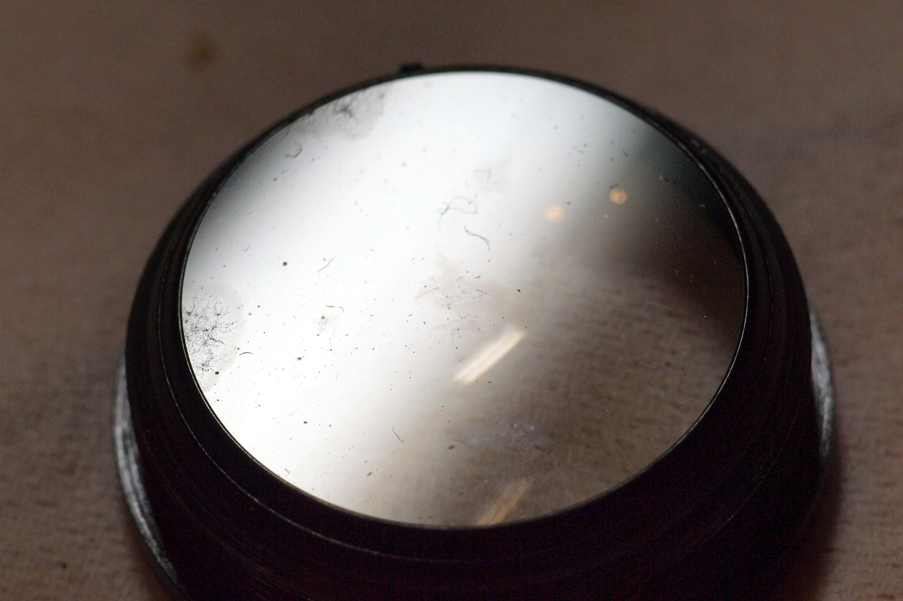

# 前後鏡組清理

這台相機所搭配的卡爾蔡司 Tessar 鏡頭也有一點霉絲需要處理。很不幸的它發霉的部份是中間那片鏡片，所以必須把整個相機前面板給拆下來。

### 鏡頭構造
蔡司的 Tessar 鏡頭的設計為四片三群，四片鏡片組成三個部份，鏡間快門就位在左邊數來第二群與第三群鏡片之間：

(圖片來源: [Wikipedia - History of photographic lens design](https://en.wikipedia.org/wiki/History_of_photographic_lens_design))

### 工具與材料

* 拭鏡紙、稀釋藥用酒精
* 一字起子
* 拆鏡扳手（克難一點用鐵尺也行，不大建議就是了）

如果只需要拆前鏡片的話，那就什麼工具也不用了。

### 拆卸前鏡片
這裡最好拆的就是最前面那片鏡片，徒手用力往逆時針方向轉就有機會可以把它轉下來，如果卡得很緊的話可以用橡膠墊之類的東西來增加摩擦力：

### 拆卸後鏡組
在把前面板拆下來之後，最先看到的會是鏡尾的遮光套筒，同樣也是用手往逆時針方向一轉就可以把它轉下來（要用拆鏡扳手也可以）：

接著就可以拆後鏡組了，同樣是往逆時針方向轉：

後鏡組的發霉情況，可以看到邊緣有幾處長了霉絲：

清理後對鏡片吹氣其實還是可以看得到當初發霉的地方：
