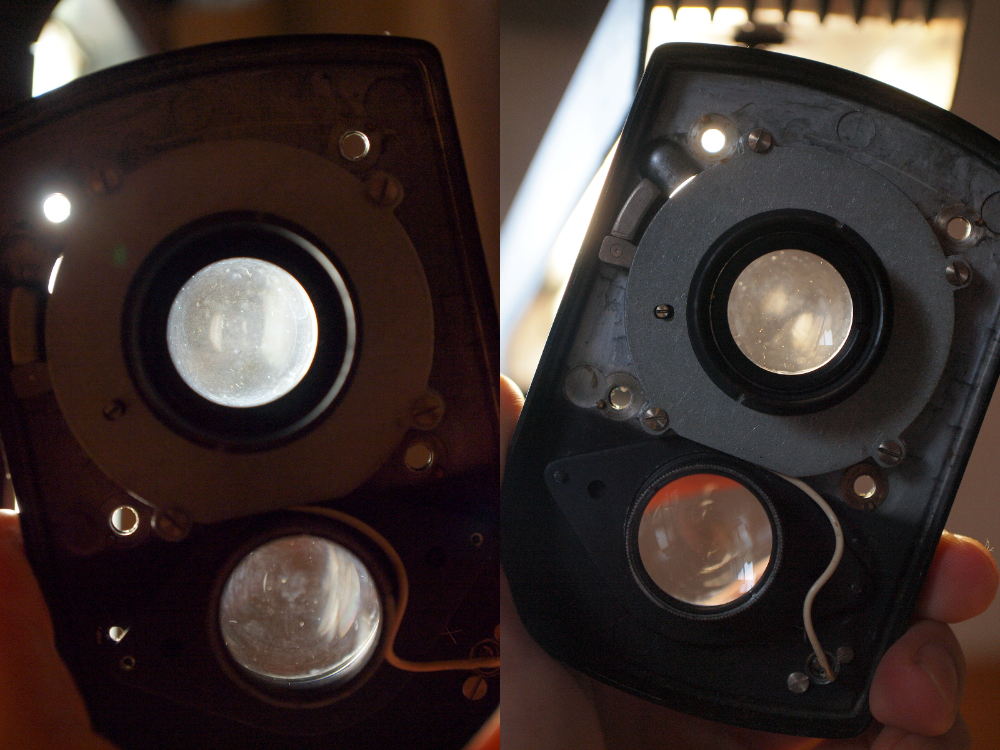

# 拍攝鏡組清理
這台相機所搭配的卡爾蔡司 Tessar 鏡頭有一點霉絲需要處理。很不幸的它發霉的部份是後面那組鏡片，所以必須[把整個相機前面板給拆下來](front_plate.md)。

### 鏡頭構造
蔡司的 Tessar 鏡頭的設計為四片三群，四片鏡片組成三個部份，鏡間快門就位在左邊數來第二群與第三群鏡片之間：

(圖片來源: [Wikipedia - History of photographic lens design](https://en.wikipedia.org/wiki/History_of_photographic_lens_design))

### 工具與材料

* 拭鏡紙、稀釋藥用酒精
* 一字起子
* 止滑橡膠墊
* 拆鏡扳手（克難一點用鐵尺也行，不大建議就是了）

如果只需要拆前鏡片的話，那就什麼工具也不用了。

### 拆卸前鏡片
這裡最好拆的就是最前面那片鏡片，徒手用力往逆時針方向轉就有機會可以把它轉下來，如果卡得很緊的話可以用橡膠墊之類的東西來增加摩擦力：

### 拆卸後鏡組
在把[前面板拆下來](front_plate.md)之後，最先看到的會是鏡尾的遮光套筒，同樣也是用手往逆時針方向一轉就可以把它轉下來（要用拆鏡扳手也可以）：

接著就可以拆後鏡組了，同樣是往逆時針方向轉：

後鏡組的發霉情況，可以看到邊緣有幾處長了霉絲：

清理後對鏡片吹氣其實還是可以看得到當初發霉的地方：

此時已經可以清理所有鏡片了，對於還沒被拆下來的中鏡組只要用T快門打開快門葉片就能處理。

### 拆卸中鏡片
如果想要拆中間那片鏡片，可以先嘗試從正面直接把中間那組鏡片往逆時針方向轉下來，不過從下圖中可以看出它只有超出機身一點點，可能不大好施力（橡膠墊應該可以派上用場）。或者是先把整個光圈快門組件拆下來，再把鏡片給轉下來。

拆下來的東西（注意快門連桿不在裡面）：

清理前後的比較，有些灰塵，不過已經好不少了：

### 組裝注意事項
將光圈快門組件裝回去的時候要注意光圈與快門撥桿要準確的與前面板撥桿的溝槽接合：

同樣的，快門撥桿也是一樣：
