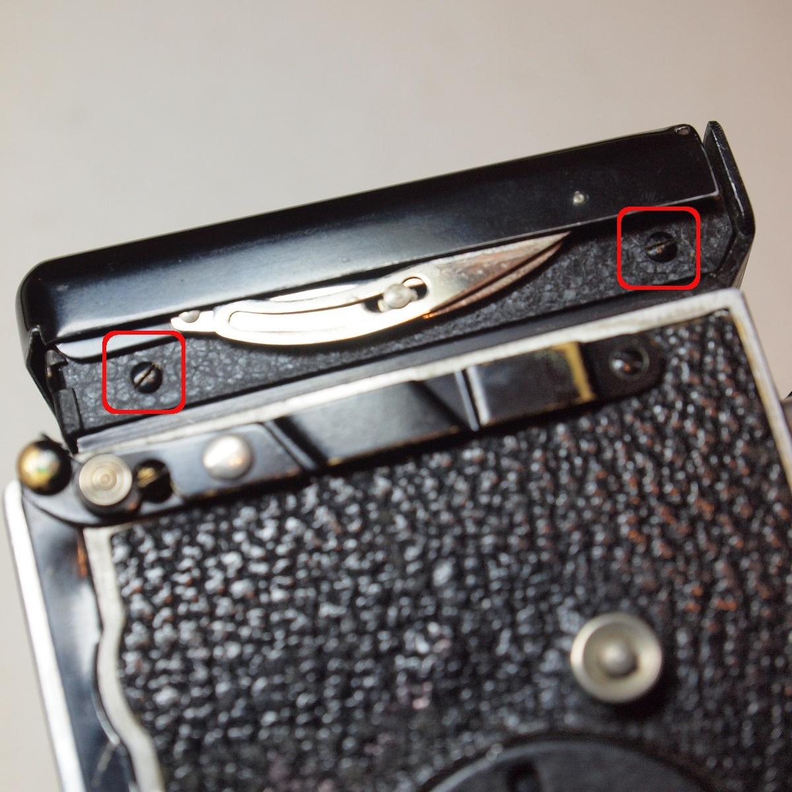
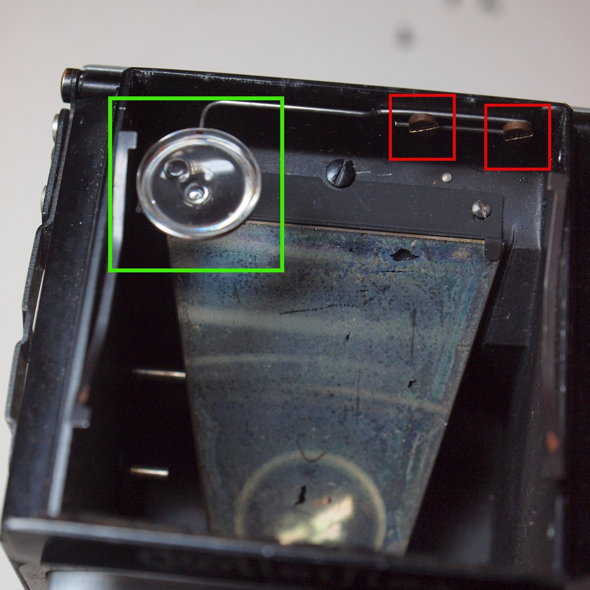
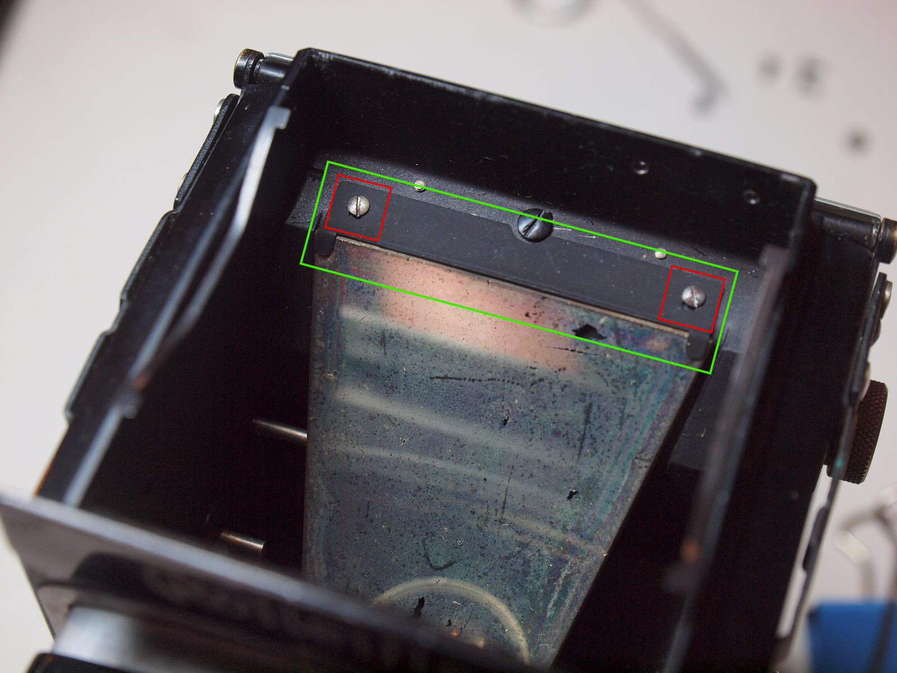
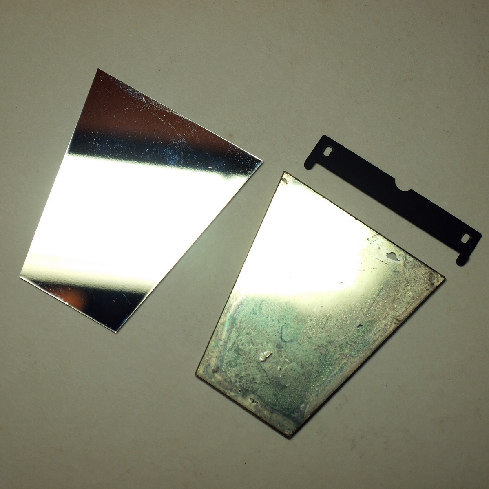
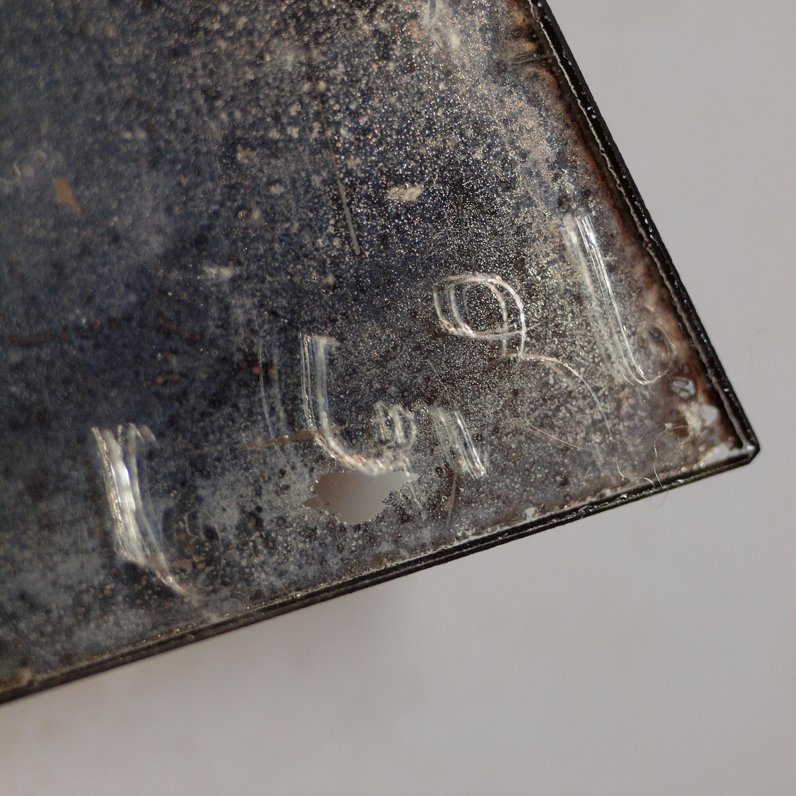
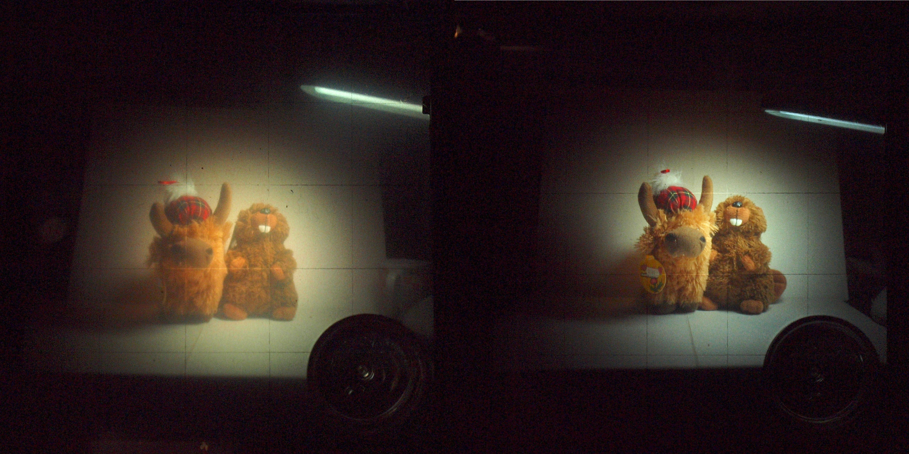

# 更換反光鏡
這台機身上的反光鏡隨著歲月的流逝已經不堪使用了，嚴重影響了進光亮與對焦判斷，雖然看起來只是髒髒的只要洗乾淨就好，但實際上只要輕輕一抹，上面鍍的反光材質立刻就會脫落，只好把它換掉。

### 工具與材料
* 一字起子
* 新的反光鏡
* 游標卡尺
* 水平儀（用以校正相機內的水平儀），用帶有水平儀並校正至水平狀態的腳架會簡單一點

### 拆卸取景器與對焦屏
1. 只要移除取景器兩側的一字螺絲，就可以將取景器與對焦屏取下：

註：對焦屏很容易刮傷，請小心輕放

2. 把水平儀拿起來，並拆下固定水平儀用的螺絲來移除水平儀支架：

3. 移除固定鏡子用的兩根螺絲以及固定片，就可以把鏡子拆下來：

新舊鏡子一比就可以看出舊的鏡子狀況有多糟：

如果反光鏡自相機出廠之後就沒有更換過的話，你會在鏡子背面的角落找到它的出廠日期（有點難辨識就是了）：

看起來似乎是 1936 年出廠的，到現在也八十年啦！

更換前與更換後的比較：

### 反光鏡規格
以下規格是從網路上取得，當初在訂製新的反光鏡時也是用這組數字（不過厚度為1.2mm）：
厚度：1.6mm
梯形高：54.5mm
上邊長：27.5mm
下邊長：47.5mm

後來用游標卡尺去測量那片拆下來的鏡子，取得的結果也差不多，只是厚度厚了點，貼上幾片塑膠片來增加厚度問題就解決了
厚度：1.85mm
梯形高：53.7mm
上邊長：27.55mm
下邊長：47.4mm

從前面照片中可以看出，上下邊長的誤差只要不要差太多，是幾乎沒有影響的，只要放得進鏡子的溝槽即可。而高度也是，不要超出固定片太多都鎖得上去。
最重要的就是鏡子的厚度，由於鏡片到底片的距離沒有變，錯誤的反光鏡厚度會導致移焦。所以在更換鏡子時有一把游標卡尺可以確定厚度會比較好。